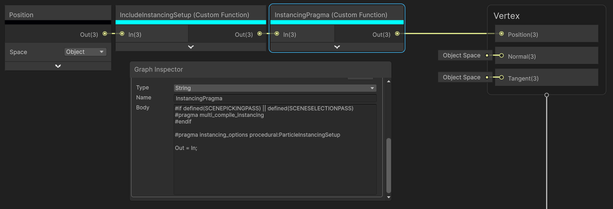
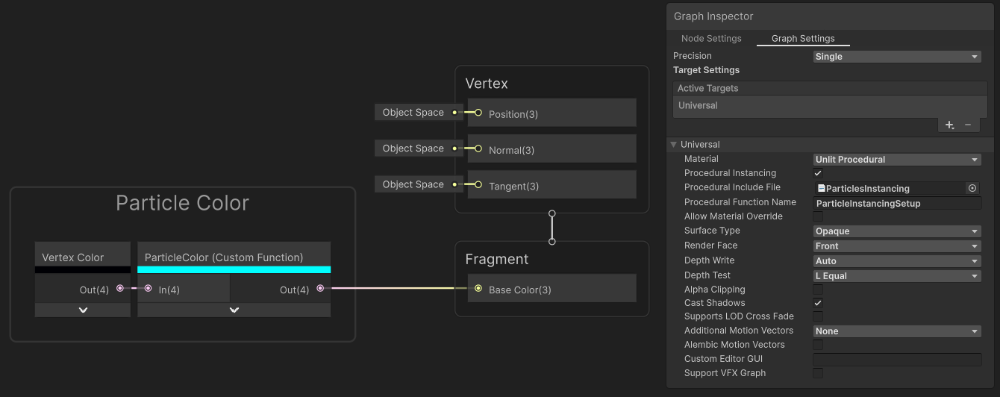
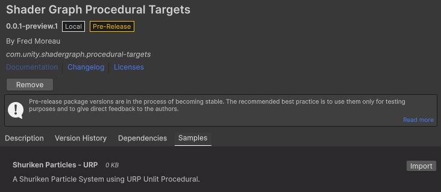
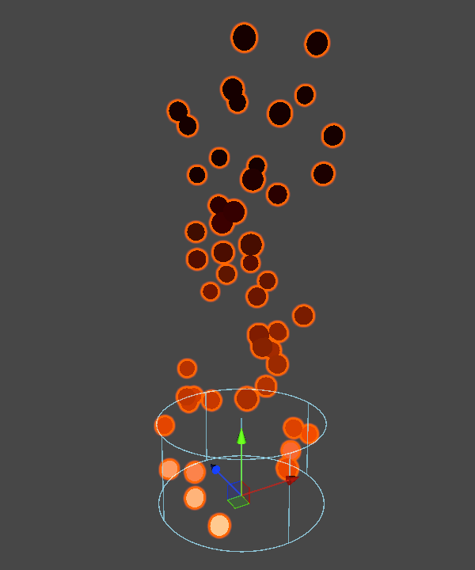

# Shader Graph Procedural Targets
Shader Graph custom targets supporting procedural instancing.

## Problem Statement
### Procedural Instancing
Requires Custom Function Nodes for injecting pragmas and include custom HLSL file.

## Solution Prototype
### Procedural Setup in Graph Settings
The custom target(s) feature additional settings for procedural setup.

- Procedural Instancing (bool): adds the required pragmas to the shader.
- Procedural Include File (ShaderInclude): the HLSL file to be included. This file must either contain, directly or through includes, the ProceduralFunction.
(e.g.:"Packages/com.unity.render-pipelines.universal/ShaderLibrary/ParticlesInstancing.hlsl)
- Procedural Function Name (string): the name of the function to be used for procedural setup.
(e.g.:"ParticleInstancingSetup")

## Setup

### Disclaimer
Just a heads-up: this stuff is for your research and personal tinkering only. Use it at your own risk – I won't be maintaining or supporting it, and I can't be held responsible for anything that happens from using it.

### Install through the Package Manager
1. Go to Window/Package Manager.
2. Click on the + icon and select "Add package from git URL...".
2. Copy/paste the following url in the field and click on Add. (This requires Git installed)
- git@github.com:FredMoreau/com.unity.shadergraph.procedural-targets.git
- You can also download the repo as a Zip file, unzip it somewhere like C://Unity_Custom_Packages/, then from the Package Manager select Add package from disk, and browse for the package.json file.

### Package Samples
The package features sample(s), available from the Package Manager.

#### Shuriken Particles - URP

This sample shows how to use the Unlit Procedural target with a Shuriken Particle system to support GPU instancing when the system uses Mesh Render Mode.

